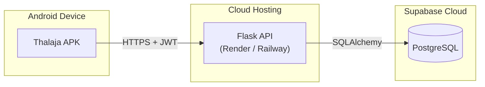

# Thalaja — Project Charter: Development (Team 1)

**Document:** Project_Charter_Development_Team1  
**Project:** Thalaja (ثلاجة) — Collaborative Shopping List App  
**Course:** SWE497 — Graduation Project II  
**Institution:** King Saud University — College of Computer and Information Sciences  
**Repository:** [github.com/0-Mousa-0/fe](https://github.com/0-Mousa-0/fe)  
**Branch:** `stage2`  
**Date:** June 9, 2026  
**Status:** Implementation, Testing & Deployment Phase  
**Reference (Stage 1):** [Technical Design Document (Part 1)](../../README.md)  
**SharePoint:** [Stage 2 Document](https://studentksuedu-my.sharepoint.com/:w:/g/personal/446202251_student_ksu_edu_sa/IQAl74pkVmisTp_nztUkk_9TAYOv3VAYCVgtzZNhhaxhp5U?rtime=ITFGFbbL3kg)

---

## Document Control

| Field | Value |
| :--- | :--- |
| **Version** | 1.0 |
| **Prepared By** | Development Team 1 |
| **Approved By** | *[Supervisor Name]* |
| **Last Updated** | June 9, 2026 |

---

## 1. Executive Summary

**Thalaja** is a cross-platform mobile application inspired by [Bring!](https://www.getbring.com/en/features/collaborative) that enables families and friend groups to create, share, and manage collaborative shopping lists in real time. Stage 1 established the architecture, domain model, and UML diagrams. **Stage 2 (this document)** defines the development charter: implementation plan, testing strategy, deployment pipeline, team responsibilities, timeline, risks, and deliverables required to complete SWE497.

The system is built with **Flutter** (client), **Flask** (REST API + JWT auth), and **Supabase PostgreSQL** (database only — no Supabase Auth on frontend).

---

## 2. Project Charter

### 2.1 Project Identification

| Item | Detail |
| :--- | :--- |
| **Project Title** | Thalaja — Collaborative Shopping List Application |
| **Project Start Date** | February 2026 (SWE496 / Stage 1) |
| **Project Finish Date** | June 2026 (SWE497 / Stage 2) |
| **Project Sponsor** | King Saud University — CCIS |
| **Project Supervisor** | *[Supervisor Name]* |
| **Development Team** | Team 1 |

### 2.2 Project Description

Thalaja allows users to:

- Register and authenticate via a secure Flask JWT backend
- Create or join **Groups** (family or friends) using invite codes
- Build **Shopping Lists** from **Categories** (occasions, grocery aisles, or recipes)
- Add, edit, check off, and remove list items collaboratively
- Import recipe ingredients directly into a shopping list
- View a per-list **History** feed showing every member's activity

### 2.3 Business Justification (Problem Statement)

Shared grocery shopping suffers from poor coordination: duplicate purchases, forgotten items, and no visibility into who changed a list. Existing apps like Bring! solve list sharing but offer limited activity tracking. Thalaja addresses this gap with a dedicated **History** module while maintaining Bring-like simplicity for list and recipe management.

### 2.4 Project Goals

| # | Goal | Success Metric |
| :--- | :--- | :--- |
| G1 | Deliver a working Flutter mobile app (Android APK minimum) | App installs and runs on target device |
| G2 | Deliver a deployed Flask REST API connected to Supabase | All MVP endpoints return correct responses |
| G3 | Implement all Must-priority use cases from Stage 1 | 100% of UC-01 to UC-05 pass functional tests |
| G4 | Provide per-list activity history | History records created for every mutating action |
| G5 | Meet SWE497 report evaluation criteria | Supervisor sign-off on final report |

### 2.5 Project Objectives

1. Implement backend business logic using the **Facade pattern** (`ThalajaFacade`)
2. Implement Flutter client using **Clean Architecture** (Presentation → Domain → Data)
3. Design and deploy PostgreSQL schema on Supabase via SQLAlchemy + Alembic
4. Execute unit, integration, and functional testing with documented results
5. Deploy API to a cloud host and distribute Flutter APK for demonstration
6. Produce final SWE497 report with screenshots, code walkthrough, and test evidence

---

## 3. Scope

### 3.1 In Scope (Stage 2)

| Area | Deliverables |
| :--- | :--- |
| **Authentication** | Register, login, JWT refresh, profile view |
| **Groups** | Create group, join via invite code, view members |
| **Lists** | Create, view, complete/archive lists per group |
| **Items** | Add, update, delete, toggle bought status |
| **Categories** | System categories (occasion, aisle); browse recipes |
| **Recipes** | View recipe details; import ingredients to list |
| **History** | Activity feed per list with action summaries |
| **Testing** | Unit tests (Flask), widget tests (Flutter), API integration tests |
| **Deployment** | Flask on Render/Railway; Supabase DB; Flutter APK build |

### 3.2 Out of Scope (Future Work)

- Push notifications (FCM)
- Offline-first sync / local caching
- Supabase Realtime WebSocket subscriptions
- iOS App Store / Google Play publication
- Payment integrations or store loyalty features
- Voice input for adding items
- Multi-language localization (Arabic/English planned for v2)

### 3.3 Assumptions

- Team has access to Supabase project credentials (DB URL only)
- Supervisor approves Flutter + Flask + Supabase stack
- Minimum one Android device/emulator available for demo
- Internet connectivity required (no offline mode in MVP)

### 3.4 Constraints

- **No Supabase Auth on frontend** — all authentication via Flask JWT
- Must follow Clean Architecture on Flutter (no business logic in widgets)
- Must follow layered architecture on Flask (API → Facade → Repository)
- SWE497 report must follow [KSU CCIS evaluation criteria](https://ccis.ksu.edu.sa/en/se/bsc-program-project2)

---

## 4. Stakeholders

| Stakeholder | Role | Interest |
| :--- | :--- | :--- |
| **Development Team 1** | Builders | Deliver working system and pass SWE497 |
| **Project Supervisor** | Academic advisor | Quality, methodology, report compliance |
| **KSU CCIS Evaluation Committee** | Graders | SWE497 rubric compliance |
| **End Users** | Families & friend groups | Easy, reliable shared shopping lists |
| **Bring! (Reference App)** | Market benchmark | Feature parity for core list sharing |

---

## 5. Team Structure & Responsibilities

| Member | ID | Role | Primary Responsibilities |
| :--- | :--- | :--- | :--- |
| *[Member 1]* | 446202251 | **Backend Lead** | Flask API, Facade, SQLAlchemy models, Alembic migrations, API tests |
| *[Member 2]* | — | **Flutter Lead** | UI screens, BLoC/Riverpod, Clean Architecture features, widget tests |
| *[Member 3]* | — | **QA / DevOps** | Integration tests, deployment (Render + Supabase), APK build, documentation |
| **All Members** | — | **Shared** | Code review, SWE497 report sections, demo preparation |

### 5.1 RACI Matrix (Key Deliverables)

| Deliverable | Backend Lead | Flutter Lead | QA / DevOps |
| :--- | :---: | :---: | :---: |
| Database schema & migrations | **R** | I | C |
| Flask REST API | **R** | I | C |
| ThalajaFacade business logic | **R** | I | C |
| Flutter UI screens | C | **R** | I |
| JWT auth flow (full stack) | **R** | **R** | C |
| Unit & integration tests | **R** | **R** | **A** |
| Deployment & APK | C | C | **R** |
| SWE497 final report | **R** | **R** | **R** |

*R = Responsible, A = Accountable, C = Consulted, I = Informed*

---

## 6. Implementation Plan

### 6.1 Technology Stack (Implementation Detail)

| Component | Technology | Version (Target) | Purpose |
| :--- | :--- | :--- | :--- |
| Mobile UI | Flutter | 3.x | Cross-platform client |
| Client Language | Dart | 3.x | Flutter development |
| State Management | BLoC | 8.x | Predictable UI state |
| HTTP Client | Dio | 5.x | REST API communication |
| DI | get_it + injectable | Latest | Dependency injection |
| Backend Framework | Flask | 3.x | REST API server |
| Backend Language | Python | 3.11+ | Business logic |
| ORM | SQLAlchemy | 2.x | Database mapping |
| Migrations | Alembic | 1.x | Schema versioning |
| Auth | Flask-JWT-Extended | 4.x | JWT access + refresh tokens |
| Password Hashing | bcrypt / werkzeug | — | Secure credential storage |
| Database | Supabase (PostgreSQL) | 15+ | Managed PostgreSQL host |
| API Testing | pytest + httpx | — | Backend test suite |
| Flutter Testing | flutter_test | — | Widget & unit tests |
| CI (optional) | GitHub Actions | — | Automated test runs |
| API Hosting | Render / Railway | — | Cloud Flask deployment |
| Mobile Build | Android SDK | API 24+ | APK generation |

### 6.2 Work Breakdown Structure (WBS)

```mermaid
graph TD
    A[Thalaja Stage 2] --> B[Backend Implementation]
    A --> C[Frontend Implementation]
    A --> D[Testing]
    A --> E[Deployment]
    A --> F[Documentation & Report]

    B --> B1[Supabase schema + Alembic]
    B --> B2[SQLAlchemy models]
    B --> B3[Repositories]
    B --> B4[ThalajaFacade]
    B --> B5[REST API v1 endpoints]
    B --> B6[JWT auth middleware]

    C --> C1[Core: network, DI, routing]
    C --> C2[Feature: Auth]
    C --> C3[Feature: Groups]
    C --> C4[Feature: Lists & Items]
    C --> C5[Feature: Categories & Recipes]
    C --> C6[Feature: History]

    D --> D1[Flask unit tests]
    D --> D2[API integration tests]
    D --> D3[Flutter widget tests]
    D --> D4[Manual functional test cases]

    E --> E1[Deploy Flask API]
    E --> E2[Configure Supabase production DB]
    E --> E3[Build & sign APK]

    F --> F1[SWE497 final report]
    F --> F2[Demo script & presentation]
```



### 6.3 Sprint Timeline

| Sprint | Weeks | Focus | Key Deliverables |
| :--- | :--- | :--- | :--- |
| **Sprint 1** | 1–2 | Backend foundation | DB schema, models, auth endpoints |
| **Sprint 2** | 3–4 | Backend features | Groups, lists, items, history logging |
| **Sprint 3** | 5–6 | Flutter foundation | Auth UI, API client, groups screen |
| **Sprint 4** | 7–8 | Flutter features | List/item UI, recipe import, history tab |
| **Sprint 5** | 9–10 | Testing & fixes | Test suites, bug fixes, code coverage |
| **Sprint 6** | 11–12 | Deployment & report | Live API, APK, SWE497 final report |

### 6.4 Milestones

| # | Milestone | Target Date | Criteria |
| :--- | :--- | :--- | :--- |
| M1 | Database schema deployed to Supabase | Week 2 | All tables created via Alembic |
| M2 | Auth flow working end-to-end | Week 4 | Register + login from Flutter → Flask → DB |
| M3 | Core list features complete | Week 6 | CRUD lists/items with history logging |
| M4 | Flutter MVP screens complete | Week 8 | All Must use cases navigable in app |
| M5 | Test suite passing | Week 10 | ≥ 70% backend code coverage |
| M6 | Production deployment | Week 11 | API live URL + installable APK |
| M7 | Final presentation & report | Week 12 | Supervisor approval |

---

## 7. Use Case → Implementation Mapping

> Required by [KSU SWE497 evaluation](https://ccis.ksu.edu.sa/en/se/bsc-program-project2): map requirements/use cases to classes and methods.

| Use Case | Priority | Flask (API + Facade) | Flutter (UseCase + Screen) |
| :--- | :--- | :--- | :--- |
| **UC-01** Register / Login | Must | `auth.py` → `ThalajaFacade.register_user()`, `authenticate()` | `RegisterUseCase`, `LoginUseCase` → `AuthPage`, `LoginPage` |
| **UC-02** Create or Join Group | Must | `groups.py` → `create_group()`, `join_group()` | `CreateGroupUseCase`, `JoinGroupUseCase` → `GroupsPage`, `JoinGroupPage` |
| **UC-03** Create List from Category | Must | `lists.py` → `create_list()` | `CreateListUseCase` → `CreateListPage`, `CategoryPicker` |
| **UC-04** Add / Check / Uncheck Items | Must | `items.py` → `add_item()`, `toggle_item()` | `AddItemUseCase`, `ToggleItemUseCase` → `ListDetailPage`, `ItemTile` |
| **UC-05** View List History | Must | `histories.py` → `get_list_history()` | `GetHistoryUseCase` → `HistoryTab`, `HistoryTimeline` |
| **UC-06** Import Recipe to List | Should | `lists.py` → `import_recipe()` | `ImportRecipeUseCase` → `RecipeDetailPage` |
| **UC-07** Complete / Archive List | Should | `lists.py` → `complete_list()` | `CompleteListUseCase` → `ListActionsMenu` |
| **UC-08** Manage Group Settings | Should | `groups.py` → `update_group()`, `remove_member()` | `UpdateGroupUseCase` → `GroupSettingsPage` |

### 7.1 Key Class Mapping (Backend)

| Domain Entity | SQLAlchemy Model | Repository | Facade Method |
| :--- | :--- | :--- | :--- |
| User | `app/models/user.py` | `UserRepository` | `register_user()`, `authenticate()` |
| Group | `app/models/group.py` | `GroupRepository` | `create_group()`, `join_group()` |
| GroupMember | `app/models/group_member.py` | `GroupRepository` | `validate_membership()` |
| ShoppingList | `app/models/shopping_list.py` | `ListRepository` | `create_list()`, `complete_list()` |
| ListItem | `app/models/list_item.py` | `ItemRepository` | `add_item()`, `toggle_item()` |
| Category | `app/models/category.py` | `CategoryRepository` | `get_categories()` |
| Recipe | `app/models/recipe.py` | `RecipeRepository` | `import_recipe()` |
| History | `app/models/history.py` | `HistoryRepository` | `_write_history()` (private helper) |

### 7.2 Key Class Mapping (Flutter)

| Feature | Domain Entity | Use Case | BLoC | Page |
| :--- | :--- | :--- | :--- | :--- |
| Auth | `User` | `LoginUseCase` | `AuthBloc` | `LoginPage` |
| Groups | `Group` | `CreateGroupUseCase` | `GroupBloc` | `GroupsPage` |
| Lists | `ShoppingList` | `CreateListUseCase` | `ListBloc` | `ListsPage` |
| Items | `ListItem` | `ToggleItemUseCase` | `ItemBloc` | `ListDetailPage` |
| History | `HistoryEntry` | `GetHistoryUseCase` | `HistoryBloc` | `HistoryTab` |
| Recipes | `Recipe` | `ImportRecipeUseCase` | `RecipeBloc` | `RecipeDetailPage` |

---

## 8. Database Implementation

### 8.1 Supabase Setup (Database Only)

```text
1. Create Supabase project at supabase.com
2. Copy PostgreSQL connection string (Settings → Database → URI)
3. Store in Flask .env as DATABASE_URL
4. Do NOT enable Supabase Auth for this project
5. Run Alembic migrations: alembic upgrade head
6. Run seed.sql for system categories and sample recipes
```

### 8.2 Schema Summary

| Table | Primary Key | Key Foreign Keys |
| :--- | :--- | :--- |
| `users` | `id` (UUID) | — |
| `groups` | `id` (UUID) | `admin_id` → users |
| `group_members` | `id` (UUID) | `group_id`, `user_id` |
| `categories` | `id` (UUID) | `created_by` → users (nullable) |
| `recipes` | `id` (UUID) | `category_id` → categories |
| `recipe_ingredients` | `id` (UUID) | `recipe_id` → recipes |
| `shopping_lists` | `id` (UUID) | `group_id`, `category_id`, `created_by` |
| `list_items` | `id` (UUID) | `list_id`, `added_by`, `bought_by` |
| `histories` | `id` (UUID) | `list_id`, `user_id` |

### 8.3 History Trigger Logic (Application Layer)

Every mutating Facade method calls `_write_history()` after a successful DB operation:

```python
# app/services/facade.py (pseudocode)
def add_item(self, user_id, list_id, data):
    self.validate_membership(user_id, list_id)
    item = self.item_repo.save(ListItem(**data))
    self._write_history(
        list_id=list_id,
        user_id=user_id,
        action="item_added",
        entity_type="list_item",
        entity_id=item.id,
        summary=f"Added {item.name} ({item.quantity} {item.unit})",
        metadata={"item_name": item.name, "quantity": item.quantity}
    )
    return item
```

---

## 9. API Implementation Checklist

| # | Method | Endpoint | Facade Method | Auth | Status |
| :--- | :--- | :--- | :--- | :---: | :---: |
| 1 | POST | `/api/v1/auth/register` | `register_user()` | — | ⬜ |
| 2 | POST | `/api/v1/auth/login` | `authenticate()` | — | ⬜ |
| 3 | POST | `/api/v1/auth/refresh` | `refresh_token()` | Refresh | ⬜ |
| 4 | GET | `/api/v1/users/me` | `get_current_user()` | JWT | ⬜ |
| 5 | POST | `/api/v1/groups` | `create_group()` | JWT | ⬜ |
| 6 | POST | `/api/v1/groups/join` | `join_group()` | JWT | ⬜ |
| 7 | GET | `/api/v1/groups` | `get_user_groups()` | JWT | ⬜ |
| 8 | GET | `/api/v1/groups/{id}` | `get_group_details()` | JWT | ⬜ |
| 9 | POST | `/api/v1/groups/{id}/lists` | `create_list()` | JWT | ⬜ |
| 10 | GET | `/api/v1/groups/{id}/lists` | `get_group_lists()` | JWT | ⬜ |
| 11 | GET | `/api/v1/lists/{id}` | `get_list_with_items()` | JWT | ⬜ |
| 12 | PATCH | `/api/v1/lists/{id}/complete` | `complete_list()` | JWT | ⬜ |
| 13 | POST | `/api/v1/lists/{id}/items` | `add_item()` | JWT | ⬜ |
| 14 | PATCH | `/api/v1/items/{id}` | `update_item()` | JWT | ⬜ |
| 15 | PATCH | `/api/v1/items/{id}/toggle` | `toggle_item()` | JWT | ⬜ |
| 16 | DELETE | `/api/v1/items/{id}` | `remove_item()` | JWT | ⬜ |
| 17 | GET | `/api/v1/categories` | `get_categories()` | JWT | ⬜ |
| 18 | GET | `/api/v1/categories/{id}/recipes` | `get_recipes()` | JWT | ⬜ |
| 19 | POST | `/api/v1/lists/{id}/import-recipe` | `import_recipe()` | JWT | ⬜ |
| 20 | GET | `/api/v1/lists/{id}/history` | `get_list_history()` | JWT | ⬜ |

---

## 10. Flutter Implementation Walkthrough

> SWE497 requires a walkthrough of main program logic from entry point through key features.

### 10.1 Application Entry Point

```text
main.dart
  └── WidgetsFlutterBinding.ensureInitialized()
  └── await configureDependencies()   // get_it setup
  └── runApp(ThalajaApp())

ThalajaApp (app.dart)
  └── MaterialApp
        ├── theme: ThalajaTheme
        ├── initialRoute: /splash
        └── routes / go_router:
              /login        → LoginPage
              /register     → RegisterPage
              /groups       → GroupsPage
              /groups/:id   → GroupDetailPage
              /lists/:id    → ListDetailPage (Items + History tabs)
              /recipes/:id  → RecipeDetailPage
```

### 10.2 Feature Flow: Toggle Item Bought

```text
ListDetailPage
  └── User taps ItemTile checkbox
  └── ItemBloc.add(ToggleItemEvent(itemId))
        └── ToggleItemUseCase.call(itemId)
              └── ItemRepositoryImpl.toggleItem(itemId)
                    └── ItemRemoteDataSource.patch('/items/{id}/toggle')
                          └── Flask API → ThalajaFacade.toggle_item()
                                ├── ItemRepository.update(is_bought=True)
                                └── HistoryRepository.log(item_checked)
  └── ItemBloc emits ItemToggled state
  └── UI rebuilds: item shown with strikethrough + buyer name
```

### 10.3 Flutter Screen Map

| Screen | Route | Primary BLoC | API Calls |
| :--- | :--- | :--- | :--- |
| Login | `/login` | `AuthBloc` | POST `/auth/login` |
| Register | `/register` | `AuthBloc` | POST `/auth/register` |
| Groups Home | `/groups` | `GroupBloc` | GET `/groups` |
| Create Group | `/groups/create` | `GroupBloc` | POST `/groups` |
| Join Group | `/groups/join` | `GroupBloc` | POST `/groups/join` |
| Group Detail | `/groups/:id` | `ListBloc` | GET `/groups/{id}/lists` |
| Create List | `/lists/create` | `ListBloc` | POST `/groups/{id}/lists` |
| List Detail | `/lists/:id` | `ItemBloc` | GET `/lists/{id}` |
| History Tab | `/lists/:id/history` | `HistoryBloc` | GET `/lists/{id}/history` |
| Recipe Detail | `/recipes/:id` | `RecipeBloc` | GET `/categories/{id}/recipes` |

---

## 11. Testing Strategy

> Aligned with [KSU SWE497 Testing Criteria](https://ccis.ksu.edu.sa/en/se/bsc-program-project2).

### 11.1 Test Approach Overview

| Level | Tool | Scope | Owner |
| :--- | :--- | :--- | :--- |
| **Unit Tests (Backend)** | pytest | Facade methods, repositories, validators | Backend Lead |
| **Unit Tests (Flutter)** | flutter_test | Use cases, BLoC logic, mappers | Flutter Lead |
| **Integration Tests (API)** | pytest + Flask test client | Full HTTP request/response cycles | Backend Lead |
| **Widget Tests (Flutter)** | flutter_test | Individual screens and widgets | Flutter Lead |
| **Functional Tests (Manual)** | Test case spreadsheet | End-to-end user scenarios | QA / DevOps |
| **Usability Tests** | Manual + 3–5 users | Task completion time, confusion points | All |

### 11.2 Functional Test Cases (Derived from Use Cases)

#### TC-01: User Registration (UC-01)

| Field | Value |
| :--- | :--- |
| **Precondition** | App installed, no existing account |
| **Steps** | 1. Open app → Register  2. Enter name, email, password  3. Tap Register |
| **Expected** | 201 response, JWT returned, redirected to Groups screen |
| **Pass/Fail** | ⬜ |

#### TC-02: Create Group (UC-02)

| Field | Value |
| :--- | :--- |
| **Precondition** | User logged in |
| **Steps** | 1. Tap "+" on Groups  2. Enter name "Family", type "family"  3. Tap Create |
| **Expected** | Group created, invite code displayed |
| **Pass/Fail** | ⬜ |

#### TC-03: Join Group via Invite Code (UC-02)

| Field | Value |
| :--- | :--- |
| **Precondition** | User B logged in; User A shared invite code |
| **Steps** | 1. Tap Join Group  2. Enter invite code  3. Tap Join |
| **Expected** | User B sees Group in list; history shows "member_joined" |
| **Pass/Fail** | ⬜ |

#### TC-04: Add Item to List (UC-04)

| Field | Value |
| :--- | :--- |
| **Precondition** | User in active shopping list |
| **Steps** | 1. Tap Add Item  2. Enter "Milk", qty 2, unit "L"  3. Save |
| **Expected** | Item appears in list; history shows "item_added" |
| **Pass/Fail** | ⬜ |

#### TC-05: Toggle Item Bought (UC-04)

| Field | Value |
| :--- | :--- |
| **Precondition** | List has unchecked item |
| **Steps** | 1. Tap checkbox on item |
| **Expected** | Item marked bought; `bought_by` set; history shows "item_checked" |
| **Pass/Fail** | ⬜ |

#### TC-06: View List History (UC-05)

| Field | Value |
| :--- | :--- |
| **Precondition** | List has prior activity |
| **Steps** | 1. Open list  2. Tap History tab |
| **Expected** | Chronological feed of all actions with user names and timestamps |
| **Pass/Fail** | ⬜ |

#### TC-07: Import Recipe (UC-06)

| Field | Value |
| :--- | :--- |
| **Precondition** | Recipe "Shakshuka" exists in system categories |
| **Steps** | 1. Browse Recipes  2. Select Shakshuka  3. Tap Import to List |
| **Expected** | All ingredients added to active list; history shows "recipe_imported" |
| **Pass/Fail** | ⬜ |

### 11.3 Input Validation Test Cases (Boundary Values)

| Input Field | Valid | Invalid | Boundary |
| :--- | :--- | :--- | :--- |
| Email | `user@ksu.edu.sa` | `notanemail`, empty | `@` only, 254 chars |
| Password | `SecurePass1!` | empty, 3 chars | min 8 chars |
| Group name | `Family` | empty | 1 char, 100 chars |
| Item quantity | `2.5` | `-1`, `abc` | `0`, `0.001`, `9999` |
| Invite code | `ABC123` | wrong code | expired code |

### 11.4 Backend Unit Test Examples

```python
# tests/test_facade.py
def test_register_user_duplicate_email(client, existing_user):
    response = client.post("/api/v1/auth/register", json={
        "email": existing_user.email,
        "password": "Pass1234!",
        "name": "Duplicate"
    })
    assert response.status_code == 400

def test_toggle_item_writes_history(client, auth_headers, list_with_item):
    item_id = list_with_item.items[0].id
    response = client.patch(f"/api/v1/items/{item_id}/toggle", headers=auth_headers)
    assert response.status_code == 200
    history = client.get(f"/api/v1/lists/{list_with_item.id}/history", headers=auth_headers)
    assert any(h["action"] == "item_checked" for h in history.json)
```

### 11.5 Code Coverage Target

| Module | Target Coverage |
| :--- | :--- |
| `app/services/facade.py` | ≥ 85% |
| `app/persistence/repositories/` | ≥ 75% |
| `app/api/v1/` | ≥ 70% |
| Flutter use cases | ≥ 80% |
| Flutter BLoC | ≥ 75% |

---

## 12. Deployment Plan

### 12.1 Environment Architecture



### 12.2 Deployment Steps

#### Flask API (Render)

```text
1. Push thalaja_api/ to GitHub
2. Create Render Web Service → connect repo
3. Set environment variables:
     DATABASE_URL=postgresql://...
     JWT_SECRET_KEY=...
     FLASK_ENV=production
4. Build command: pip install -r requirements.txt
5. Start command: gunicorn run:app
6. Verify: GET https://thalaja-api.onrender.com/health → 200 OK
```

#### Supabase Database

```text
1. Create production Supabase project
2. Run: alembic upgrade head
3. Run: psql < supabase/seed.sql
4. Restrict DB access to API server IP only (if applicable)
5. Never expose service_role key in Flutter app
```

#### Flutter APK

```bash
# Build release APK
cd thalaja_mobile
flutter build apk --release \
  --dart-define=API_BASE_URL=https://thalaja-api.onrender.com

# Output: build/app/outputs/flutter-apk/app-release.apk
```

### 12.3 Environment Variables

| Variable | Location | Description |
| :--- | :--- | :--- |
| `DATABASE_URL` | Flask `.env` | Supabase PostgreSQL connection string |
| `JWT_SECRET_KEY` | Flask `.env` | Secret for signing JWT tokens |
| `JWT_ACCESS_EXPIRES` | Flask `.env` | Access token TTL (e.g., 15 min) |
| `JWT_REFRESH_EXPIRES` | Flask `.env` | Refresh token TTL (e.g., 7 days) |
| `API_BASE_URL` | Flutter `--dart-define` | Flask API base URL |
| `FLASK_ENV` | Flask `.env` | `development` or `production` |

---

## 13. Risk Management

| # | Risk | Probability | Impact | Mitigation |
| :--- | :--- | :---: | :---: | :--- |
| R1 | Supabase connection issues | Medium | High | Test DB early in Sprint 1; keep local PostgreSQL fallback |
| R2 | JWT token expiry UX problems | Medium | Medium | Implement silent refresh in Dio interceptor |
| R3 | Team member unavailable | Low | High | Cross-train; document all modules in README |
| R4 | Scope creep (adding features) | High | Medium | Strict MVP; defer Should-priority items if behind schedule |
| R5 | Flutter-Flask integration bugs | Medium | High | Integration tests from Sprint 3 onward |
| R6 | APK build failures | Low | Medium | Test build pipeline in Sprint 5, not Sprint 6 |
| R7 | Insufficient test coverage for SWE497 | Medium | High | Allocate Sprint 5 entirely to testing |

---

## 14. Quality Assurance

### 14.1 Definition of Done (DoD)

A feature is **done** when:

- [ ] Facade method implemented with validation and history logging
- [ ] API endpoint returns correct status codes and JSON schema
- [ ] Flutter screen connected to BLoC and API
- [ ] Unit tests written and passing
- [ ] Manual functional test case executed and recorded
- [ ] Code reviewed by at least one other team member
- [ ] No critical linter errors

### 14.2 Code Review Checklist

- [ ] No business logic in Flutter widgets or Flask route handlers
- [ ] All DB access goes through repositories (not raw SQL in routes)
- [ ] Passwords never logged or returned in API responses
- [ ] JWT required on all protected endpoints
- [ ] History written for every mutating operation
- [ ] `.env` files not committed to Git

### 14.3 Git Branching Strategy

| Branch | Purpose |
| :--- | :--- |
| `main` | Stable Stage 1 design documentation |
| `stage2` | Stage 2 implementation documentation & code |
| `feature/*` | Individual feature branches |
| `fix/*` | Bug fix branches |

---

## 15. Deliverables (SWE497)

| # | Deliverable | Format | Due |
| :--- | :--- | :--- | :--- |
| D1 | Project Charter (this document) | Markdown / PDF | Week 2 |
| D2 | Working Flask REST API | GitHub + live URL | Week 10 |
| D3 | Working Flutter APK | `.apk` file | Week 11 |
| D4 | Test report with screenshots | PDF / Markdown | Week 11 |
| D5 | SWE497 Final Report | PDF (KSU template) | Week 12 |
| D6 | Final presentation | PowerPoint / Demo | Week 12 |
| D7 | GitHub repository | [github.com/0-Mousa-0/fe](https://github.com/0-Mousa-0/fe) | Week 12 |

---

## 16. Communication Plan

| Activity | Frequency | Channel | Participants |
| :--- | :--- | :--- | :--- |
| Sprint planning | Bi-weekly | Microsoft Teams / WhatsApp | All team |
| Supervisor meeting | Bi-weekly | In-person / Teams | Team + Supervisor |
| Code review | Per PR | GitHub Pull Requests | All developers |
| Progress report | Weekly | SharePoint / GitHub Wiki | Team + Supervisor |
| Issue tracking | Ongoing | GitHub Issues | All team |

---

## 17. Approval & Sign-Off

| Role | Name | Signature | Date |
| :--- | :--- | :--- | :--- |
| **Team Lead** | *[Name]* | _______________ | ___ / ___ / 2026 |
| **Backend Lead** | *[Name]* | _______________ | ___ / ___ / 2026 |
| **Flutter Lead** | *[Name]* | _______________ | ___ / ___ / 2026 |
| **Project Supervisor** | *[Name]* | _______________ | ___ / ___ / 2026 |

---

## 18. References

- [Stage 1 — Technical Design Document (Part 1)](../../README.md)
- [Stage 2 — SharePoint Document](https://studentksuedu-my.sharepoint.com/:w:/g/personal/446202251_student_ksu_edu_sa/IQAl74pkVmisTp_nztUkk_9TAYOv3VAYCVgtzZNhhaxhp5U?rtime=ITFGFbbL3kg)
- [KSU CCIS — SWE497 Project II Requirements](https://ccis.ksu.edu.sa/en/se/bsc-program-project2)
- [Bring! — Collaborative Shopping Lists](https://www.getbring.com/en/features/collaborative)
- [Thalaja Miro Board](https://miro.com/welcomeonboard/TGNsOHQ4SVpPN2l3VnFmQmpSMFVNVFdzbUFabGZvaW5MM1B0SE5BSG1nT0ZoOTFyWE5hZVNXWjBjMzhIeHNjZFR0N3JXUjBoRmc2cDlyTUJOSitsTm5CNmN6am1pT3JZZzVram40NXhscWQ5RHVqMVllcVlTbEp1Um4zM3hFcHF0R2lncW1vRmFBVnlLcVJzTmdFdlNRPT0hdjE=?share_link_id=514202759014)
- [Project Repository — stage2 branch](https://github.com/0-Mousa-0/fe/tree/stage2)

---

## 19. Appendix A — Non-Functional Requirements

| ID | Requirement | Fit Criterion |
| :--- | :--- | :--- |
| NFR-01 | API response time | ≤ 500 ms for 95% of requests under normal load |
| NFR-02 | Password security | Passwords hashed with bcrypt; never stored in plain text |
| NFR-03 | Authentication | All protected endpoints require valid JWT; expired tokens return 401 |
| NFR-04 | Data integrity | Foreign key constraints enforced at DB level |
| NFR-05 | Availability | API uptime ≥ 99% during demo period |
| NFR-06 | Usability | New user can create a list within 3 minutes without help |
| NFR-07 | Maintainability | Clean Architecture enforced; no circular dependencies |
| NFR-08 | Scalability | Architecture supports 100 concurrent users without redesign |

---

## 20. Appendix B — Seed Data (System Categories)

| Category Name | Type | Icon | Sample Lists |
| :--- | :--- | :--- | :--- |
| Weekly Groceries | `grocery_aisle` | 🛒 | Default family list |
| Picnic | `occasion` | 🧺 | Outdoor event list |
| BBQ Party | `occasion` | 🔥 | Grilling supplies |
| Dairy | `grocery_aisle` | 🥛 | Aisle grouping |
| Produce | `grocery_aisle` | 🥦 | Aisle grouping |
| Middle Eastern Recipes | `recipe` | 🍳 | Shakshuka, Kabsa, Hummus |
